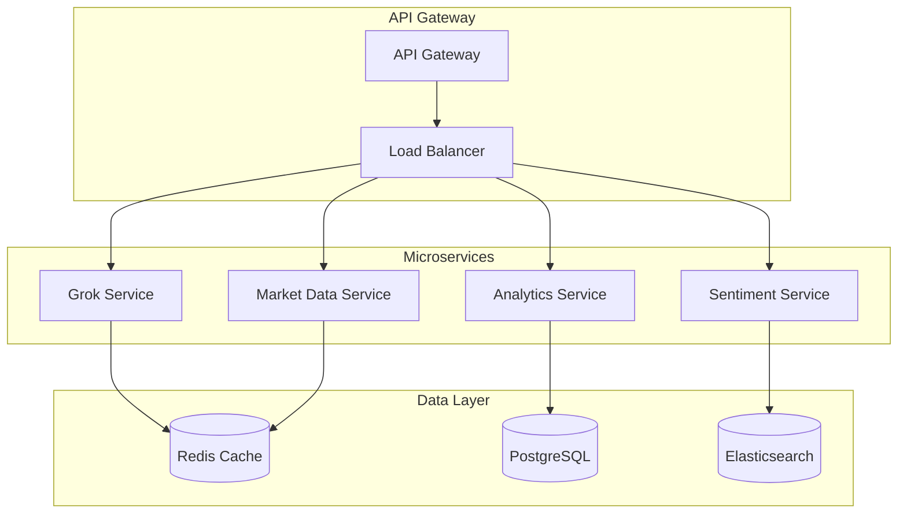

# GROK420: Real-Time Crypto Market Intelligence with X Sentiment Analysis

## Overview

GROK420 is a sophisticated AI-powered crypto market intelligence system that leverages Grok 4's real-time X (Twitter) data integration to provide comprehensive market analysis, sentiment insights, and actionable trading intelligence.

## System Architecture

```mermaid
graph TB
    subgraph "Frontend Layer"
        UI[Chat UI]
        Stream[Streaming Response]
    end
    
    subgraph "API Gateway"
        Route[/api/grok4]
        RateLimit[Rate Limiting]
        Auth[Authentication]
    end
    
    subgraph "Grok 4 Core"
        Grok4[Grok 4 API]
        Tools[Tool Functions]
        Prompt[System Prompts]
    end
    
    subgraph "Data Sources"
        CoinGecko[CoinGecko API]
        Twitter[Twitter/X API]
        News[News APIs]
        Macro[Macro Data]
    end
    
    subgraph "Tool Functions"
        XSentiment[get_x_sentiment]
        CryptoPrice[get_crypto_price]
        MarketData[get_market_data]
        WebSearch[search]
    end
    
    subgraph "Analysis Engine"
        Sentiment[Sentiment Analysis]
        Technical[Technical Analysis]
        Macro[Macro Analysis]
        Narrative[Narrative Detection]
    end
    
    subgraph "Caching & Performance"
        Cache[Redis Cache]
        RateLimit[Rate Limiting]
        Monitoring[Performance Tracking]
    end
    
    UI --> Route
    Route --> RateLimit
    RateLimit --> Auth
    Auth --> Grok4
    Grok4 --> Tools
    Tools --> XSentiment
    Tools --> CryptoPrice
    Tools --> MarketData
    Tools --> WebSearch
    
    XSentiment --> Twitter
    CryptoPrice --> CoinGecko
    MarketData --> CoinGecko
    WebSearch --> News
    
    Grok4 --> Sentiment
    Grok4 --> Technical
    Grok4 --> Macro
    Grok4 --> Narrative
    
    Sentiment --> Cache
    Technical --> Cache
    Macro --> Cache
    Narrative --> Cache
    
    Cache --> Monitoring
    RateLimit --> Monitoring
```

## Core Architecture

### 1. **Grok 4 API Integration**
- **Base URL**: `https://api.x.ai/v1`
- **Model**: `grok-4` (latest XAI model)
- **Authentication**: Bearer token via `XAI_API_KEY`
- **Streaming Support**: Real-time responses with tool calling

### 2. **Tool-Augmented Intelligence**
The system uses function calling to enhance Grok 4's capabilities:

#### **Available Tools:**
- `search`: Web search for real-time information
- `get_crypto_price`: Real-time cryptocurrency prices
- `get_market_data`: Comprehensive market data
- `get_x_sentiment`: X sentiment analysis for specific tweets

## Key Features

### 🌅 **"GM" Market Report**
When users say "gm" or "good morning", the system provides:

#### **Bitcoin Analysis**
- Real-time BTC price from CoinGecko
- X sentiment analysis using Grok 4
- Key narratives and whale movements
- Technical indicators and support/resistance levels

#### **Altcoin Intelligence**
- Top 8 altcoins: ETH, SOL, ADA, DOT, LINK, AVAX, MATIC, ATOM
- 24h performance with visual indicators
- Altcoin season detection
- Emerging token analysis

#### **Crypto Stock Tracking**
- **MSTR** (MicroStrategy): Bitcoin treasury
- **COIN** (Coinbase): Exchange performance
- **HOOD** (Robinhood): Retail trading
- **SQ** (Block): Payment integration
- **PYPL** (PayPal): Digital payments
- **TSLA** (Tesla): Corporate adoption
- **NVDA** (NVIDIA): AI/GPU correlation
- **AMD** (Advanced Micro Devices): Semiconductor trends

#### **Macro Context**
- S&P 500 and Magnificent 7 performance
- Fed policy and interest rate expectations
- Institutional adoption trends
- Regulatory developments

### 🔍 **X Sentiment Analysis**
```typescript
export async function getXSentiment(tweetUrl: string): Promise<string> {
  const analysis = await TweetAnalyzer.analyzeTweet(tweetUrl);
  return formatAnalysis(analysis);
}
```

**Features:**
- Real-time tweet analysis
- Key points extraction
- Suggested titles and tags
- Sentiment scoring
- Narrative detection

### 💰 **Price Intelligence**
```typescript
export async function getCryptoPrice(query: string): Promise<string> {
  // Supports 50+ cryptocurrencies
  // Real-time price + 24h change + market cap
}
```

**Supported Assets:**
- Bitcoin, Ethereum, Solana, Cardano
- DeFi tokens: UNI, AAVE, SUSHI, CRV
- Memecoins: DOGE, SHIB, PEPE
- Layer 1s: DOT, LINK, AVAX, MATIC

## Implementation Details

### **System Prompts**
```typescript
const DEFAULT_SYSTEM_PROMPT = `You are a crypto trading expert with a witty, concise style, pulling insights from real-time X (Twitter) data and technical indicators. Always:
- Analyze sentiment and trends from X posts, especially from high-profile accounts
- Detect emerging tokens, memecoins, and macro events
- Combine X sentiment with technical analysis (RSI, MACD, etc.)
- Provide actionable, context-rich, and concise responses
- Use the latest X data for all crypto and Bitcoin queries
- For GM queries: Focus on Bitcoin sentiment, altcoin season indicators, crypto stock performance, and macro factors
- Include specific X narratives and key events to watch`;
```

### **Tool Definitions**
```typescript
const ENHANCED_TOOLS: ChatCompletionTool[] = [
  {
    type: 'function',
    function: {
      name: 'get_x_sentiment',
      description: 'Analyze sentiment and key points from a specific X (Twitter) post.',
      parameters: {
        type: 'object',
        properties: {
          tweetUrl: {
            type: 'string',
            description: 'The URL of the X (Twitter) post to analyze.'
          }
        },
        required: ['tweetUrl']
      }
    }
  }
  // ... other tools
];
```

### **Market Data Fetching**
```typescript
async function getCryptoStocksData(): Promise<string> {
  const cryptoStocks = ['MSTR', 'COIN', 'HOOD', 'SQ', 'PYPL', 'TSLA', 'NVDA', 'AMD'];
  // Parallel API calls to CoinGecko
  // Format with emojis and percentage changes
}

async function getAltcoinsData(): Promise<string> {
  const altcoins = ['ethereum', 'solana', 'cardano', 'polkadot', 'chainlink', 'avalanche-2', 'polygon', 'cosmos'];
  // Real-time price fetching
  // Visual indicators for gains/losses
}
```

## Use Cases

### 1. **Morning Market Briefing**
**Trigger**: "gm" or "good morning"
**Output**: Comprehensive market report with all assets and X sentiment

### 2. **Real-Time Price Queries**
**Trigger**: "What's Bitcoin's price?" or "ETH price"
**Output**: Current price + 24h change + market context

### 3. **X Sentiment Analysis**
**Trigger**: Tweet URL or sentiment request
**Output**: Key points, narrative analysis, suggested actions

### 4. **Market Research**
**Trigger**: "Analyze crypto stocks" or "altcoin season"
**Output**: Technical analysis + social sentiment + macro factors

## Performance Optimizations

### **Caching Strategy**
- BTC price cache: 2-minute TTL
- Rate limiting: 10 requests/minute per client
- Conversation history: Last 10 messages

### **Error Handling**
- Graceful fallbacks for API failures
- Retry logic for network issues
- Detailed logging for debugging

### **Streaming Support**
- Real-time responses for long queries
- Tool calling in streaming mode
- Progressive content delivery

## Security & Monitoring

### **Input Sanitization**
```typescript
function sanitizeMessage(message: string): string {
  return message
    .replace(/<script\b[^<]*(?:(?!<\/script>)<[^<]*)*<\/script>/gi, '')
    .replace(/javascript:/gi, '')
    .replace(/on\w+\s*=/gi, '')
    .substring(0, MAX_MESSAGE_LENGTH)
    .trim();
}
```

### **Rate Limiting**
- Client-based rate limiting
- IP address tracking
- Automatic throttling

### **Performance Tracking**
```typescript
class PerformanceTracker {
  private timings: Record<string, number> = {};
  start(label: string) { /* ... */ }
  end(label: string) { /* ... */ }
  logTimings() { /* ... */ }
}
```

## API Endpoints

### **Main Chat Endpoint**
```
POST /api/grok4
Content-Type: application/json

{
  "message": "gm",
  "systemPrompt": "optional custom prompt",
  "temperature": 0.7,
  "stream": false
}
```

### **Image Generation**
```
POST /api/grok4/image
{
  "prompt": "Bitcoin price chart with bullish indicators"
}
```

## Integration Examples

### **Frontend Integration**
```typescript
const response = await fetch('/api/grok4', {
  method: 'POST',
  headers: { 'Content-Type': 'application/json' },
  body: JSON.stringify({
    message: 'gm',
    stream: false
  })
});

const marketReport = await response.text();
```

### **Streaming Response**
```typescript
const stream = await fetch('/api/grok4', {
  method: 'POST',
  headers: { 'Content-Type': 'application/json' },
  body: JSON.stringify({
    message: 'Analyze Bitcoin sentiment',
    stream: true
  })
});

const reader = stream.body?.getReader();
// Process streaming response
```

## 🚀 Improvement Suggestions

### **1. Enhanced Tool Functions**

#### **Technical Analysis Tools**
```typescript
// Add new tools for technical analysis
{
  name: 'get_technical_indicators',
  description: 'Get RSI, MACD, Bollinger Bands for any cryptocurrency',
  parameters: {
    symbol: 'string',
    timeframe: 'string', // 1h, 4h, 1d, 1w
    indicators: 'array' // ['rsi', 'macd', 'bollinger']
  }
}

{
  name: 'get_support_resistance',
  description: 'Identify key support and resistance levels',
  parameters: {
    symbol: 'string',
    timeframe: 'string'
  }
}
```

#### **Portfolio Management**
```typescript
{
  name: 'analyze_portfolio',
  description: 'Analyze portfolio performance and risk',
  parameters: {
    holdings: 'array', // [{symbol: 'BTC', amount: 1.5}]
    timeframe: 'string'
  }
}

{
  name: 'get_portfolio_risk',
  description: 'Calculate portfolio risk metrics',
  parameters: {
    holdings: 'array',
    risk_tolerance: 'string' // 'conservative', 'moderate', 'aggressive'
  }
}
```

#### **Advanced X Integration**
```typescript
{
  name: 'get_x_trends',
  description: 'Get trending crypto topics on X',
  parameters: {
    timeframe: 'string', // '1h', '24h', '7d'
    category: 'string' // 'crypto', 'bitcoin', 'defi'
  }
}

{
  name: 'analyze_influencer_sentiment',
  description: 'Analyze sentiment from specific crypto influencers',
  parameters: {
    usernames: 'array', // ['@michael_saylor', '@cz_binance']
    timeframe: 'string'
  }
}
```

### **2. Real-Time Data Enhancements**

#### **WebSocket Integration**
```typescript
// Real-time price updates
const ws = new WebSocket('wss://stream.binance.com:9443/ws/btcusdt@trade');
ws.onmessage = (event) => {
  const price = JSON.parse(event.data);
  updateBTCPrice(price.p);
};
```

#### **Advanced Caching Strategy**
```typescript
// Redis-based caching with TTL
const cache = new Redis({
  host: process.env.REDIS_HOST,
  port: process.env.REDIS_PORT,
  password: process.env.REDIS_PASSWORD,
});

async function getCachedData(key: string, ttl: number) {
  const cached = await cache.get(key);
  if (cached) return JSON.parse(cached);
  
  const data = await fetchFreshData();
  await cache.setex(key, ttl, JSON.stringify(data));
  return data;
}
```

### **3. Machine Learning Integration**

#### **Sentiment Scoring**
```typescript
// Enhanced sentiment analysis with ML
interface SentimentScore {
  positive: number;
  negative: number;
  neutral: number;
  confidence: number;
  keywords: string[];
  influencers: string[];
}

async function analyzeSentimentML(text: string): Promise<SentimentScore> {
  // Use pre-trained models for crypto sentiment
  const model = await loadSentimentModel();
  return model.predict(text);
}
```

#### **Price Prediction Models**
```typescript
// Simple price prediction based on sentiment
async function predictPriceMovement(symbol: string, sentiment: SentimentScore): Promise<{
  direction: 'bullish' | 'bearish' | 'neutral';
  confidence: number;
  timeframe: string;
}> {
  // Combine technical indicators with sentiment
  const technical = await getTechnicalIndicators(symbol);
  const prediction = await mlModel.predict({
    sentiment,
    technical,
    market_data: await getMarketData([symbol])
  });
  
  return prediction;
}
```

### **4. Advanced Analytics Dashboard**

#### **Real-Time Metrics**
```typescript
interface MarketMetrics {
  fear_greed_index: number;
  bitcoin_dominance: number;
  total_market_cap: number;
  volume_24h: number;
  active_addresses: number;
  network_hash_rate: number;
}

async function getMarketMetrics(): Promise<MarketMetrics> {
  // Aggregate data from multiple sources
  const [fearGreed, dominance, marketCap] = await Promise.all([
    fetchFearGreedIndex(),
    fetchBitcoinDominance(),
    fetchTotalMarketCap()
  ]);
  
  return { fear_greed_index: fearGreed, bitcoin_dominance: dominance, total_market_cap: marketCap };
}
```

### **5. Enhanced User Experience**

#### **Personalized Responses**
```typescript
interface UserProfile {
  risk_tolerance: 'conservative' | 'moderate' | 'aggressive';
  preferred_assets: string[];
  trading_style: 'day_trading' | 'swing_trading' | 'hodl';
  experience_level: 'beginner' | 'intermediate' | 'advanced';
}

async function personalizeResponse(message: string, userProfile: UserProfile): Promise<string> {
  const systemPrompt = generatePersonalizedPrompt(userProfile);
  return await Grok4Service.chatCompletion({
    messages: [
      { role: 'system', content: systemPrompt },
      { role: 'user', content: message }
    ]
  });
}
```

#### **Interactive Charts**
```typescript
// Generate chart URLs for technical analysis
async function generateChart(symbol: string, timeframe: string, indicators: string[]): Promise<string> {
  const chartUrl = `https://www.tradingview.com/chart/?symbol=${symbol}&interval=${timeframe}`;
  return chartUrl;
}
```

### **6. Advanced Error Handling & Monitoring**

#### **Circuit Breaker Pattern**
```typescript
class CircuitBreaker {
  private failures = 0;
  private lastFailureTime = 0;
  private state: 'CLOSED' | 'OPEN' | 'HALF_OPEN' = 'CLOSED';
  
  async execute<T>(fn: () => Promise<T>): Promise<T> {
    if (this.state === 'OPEN' && Date.now() - this.lastFailureTime > 60000) {
      this.state = 'HALF_OPEN';
    }
    
    try {
      const result = await fn();
      this.onSuccess();
      return result;
    } catch (error) {
      this.onFailure();
      throw error;
    }
  }
}
```

#### **Advanced Logging**
```typescript
interface LogEntry {
  timestamp: string;
  level: 'info' | 'warn' | 'error';
  message: string;
  metadata: {
    userId?: string;
    requestId: string;
    responseTime: number;
    toolCalls: string[];
    error?: string;
  };
}

class AdvancedLogger {
  async log(entry: LogEntry) {
    // Send to multiple destinations
    await Promise.all([
      this.sendToElasticsearch(entry),
      this.sendToSlack(entry),
      this.sendToMetrics(entry)
    ]);
  }
}
```

### **7. Performance Optimizations**

#### **Database Integration**
```typescript
// Store conversation history and user preferences
interface Conversation {
  id: string;
  userId: string;
  messages: ChatCompletionMessageParam[];
  createdAt: Date;
  updatedAt: Date;
}

async function saveConversation(conversation: Conversation) {
  await prisma.conversation.create({
    data: conversation
  });
}
```

#### **CDN Integration**
```typescript
// Cache static responses
const cdnCache = new Map<string, { data: any; expires: number }>();

async function getCachedResponse(key: string): Promise<any | null> {
  const cached = cdnCache.get(key);
  if (cached && cached.expires > Date.now()) {
    return cached.data;
  }
  return null;
}
```

### **8. Security Enhancements**

#### **API Key Rotation**
```typescript
class APIKeyManager {
  private keys: string[] = [];
  private currentIndex = 0;
  
  getNextKey(): string {
    const key = this.keys[this.currentIndex];
    this.currentIndex = (this.currentIndex + 1) % this.keys.length;
    return key;
  }
}
```

#### **Request Validation**
```typescript
import { z } from 'zod';

const RequestSchema = z.object({
  message: z.string().min(1).max(2000),
  systemPrompt: z.string().optional(),
  temperature: z.number().min(0).max(2).optional(),
  stream: z.boolean().optional(),
});

async function validateRequest(body: unknown) {
  return RequestSchema.parse(body);
}
```

### **9. Scalability Improvements**

#### **Microservices Architecture**


#### **Horizontal Scaling**
```typescript
// Kubernetes deployment
apiVersion: apps/v1
kind: Deployment
metadata:
  name: grok420-api
spec:
  replicas: 3
  selector:
    matchLabels:
      app: grok420-api
  template:
    metadata:
      labels:
        app: grok420-api
    spec:
      containers:
      - name: grok420-api
        image: grok420/api:latest
        ports:
        - containerPort: 3000
        env:
        - name: XAI_API_KEY
          valueFrom:
            secretKeyRef:
              name: grok420-secrets
              key: xai-api-key
```

### **10. Future Roadmap**

#### **Phase 1: Enhanced Analytics (Q1 2024)**
- [ ] Advanced technical indicators
- [ ] Portfolio risk analysis
- [ ] Real-time alerts
- [ ] Custom dashboards

#### **Phase 2: AI/ML Integration (Q2 2024)**
- [ ] Price prediction models
- [ ] Sentiment ML models
- [ ] Pattern recognition
- [ ] Automated trading signals

#### **Phase 3: Enterprise Features (Q3 2024)**
- [ ] Multi-user support
- [ ] API rate limiting
- [ ] White-label solutions
- [ ] Advanced reporting

#### **Phase 4: Advanced Features (Q4 2024)**
- [ ] Real-time streaming
- [ ] Advanced charting
- [ ] Social trading
- [ ] Mobile app

## Environment Variables

```bash
# Required
XAI_API_KEY=your_xai_api_key
TWITTER_BEARER_TOKEN=your_twitter_bearer_token

# Optional
OPENAI_API_KEY=your_openai_key_for_fallback
```

## Deployment

### **Vercel Deployment**
```bash
npm run build
vercel --prod
```

### **Environment Setup**
1. Configure XAI API key
2. Set up Twitter API credentials
3. Configure rate limiting
4. Set up monitoring

## Monitoring & Analytics

### **Key Metrics**
- Response times
- Tool call success rates
- Error rates by endpoint
- User engagement patterns

### **Logging**
- Request/response logging
- Performance timing
- Error tracking
- Usage analytics

## Conclusion

GROK420 represents a cutting-edge approach to crypto market intelligence, combining the power of Grok 4's real-time X data integration with sophisticated market analysis tools. The system provides actionable insights for traders, investors, and crypto enthusiasts while maintaining high performance and reliability standards.

The architecture is designed for scalability, with clear separation of concerns, comprehensive error handling, and extensive monitoring capabilities. As the crypto market evolves, the system can be easily extended with new tools, data sources, and analysis capabilities.

The improvement suggestions outlined above provide a roadmap for transforming GROK420 from a functional prototype into a production-ready, enterprise-grade crypto market intelligence platform. 