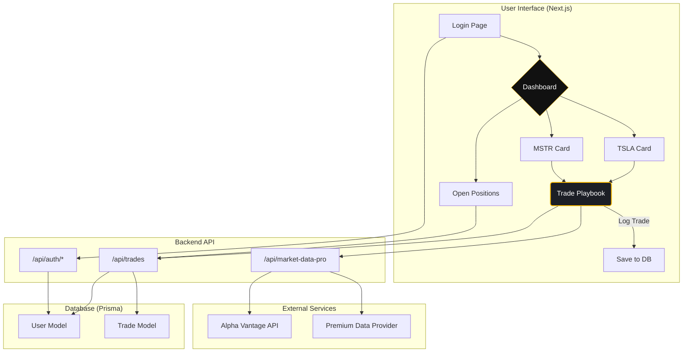

# The Covered Call Command Center: A Vision

This document outlines the vision for the **Covered Call Command Center**, a laser-focused application designed to master the art of generating income by selling covered calls on high-conviction stocks like Tesla (TSLA) and MicroStrategy (MSTR).

## The Elevator Pitch: Why This is a Killer App

For investors holding long-term positions in stocks they love, a core challenge is making those assets productive. Selling covered calls is a powerful strategy to generate consistent income, but executing it effectively is a manual, disjointed process involving multiple browser tabs, spreadsheets, and gut-feel decisions.

The **Covered Call Command Center** solves this. It's not a generic trading platform; it's a specialized, strategy-first tool that transforms the process from a manual chore into a streamlined, data-driven workflow. It helps you make smarter decisions, manage risk with discipline, and turn your best ideas into reliable income.

## The Core Problem: The Friction in Covered Call Trading

Successfully selling covered calls requires answering several key questions at the right time:
- Is now a good time to sell a call? (Is volatility high?)
- What's the right strike price to balance risk and reward?
- Am I too close to an earnings announcement?
- How do I manage the trade once it's on? Am I sticking to my rules?
- How is this strategy actually performing over time?

Answering these questions today involves juggling a broker interface, a charting platform, a news site, and manual calculations. This friction leads to missed opportunities and undisciplined, emotional decisions.

## Our Solution: A Laser-Focused Command Center

This application is designed as a complete, end-to-end solution for the disciplined covered call seller.

### Core Workflow: From Idea to Income

The app guides the user through a seamless, repeatable workflow built on a proven playbook.

1.  **Trade Setup & Strike Recommendation**:
    -   The app starts by pulling in **live market data** (spot price, earnings dates, and technicals like Bollinger Bands) for our core holdings.
    -   By inputting the **IV-Rank** (or eventually, pulling it from a premium feed), the app provides a data-driven **Delta recommendation**, removing guesswork from strike selection.

2.  **Live Trade Tracker & Guidance**:
    -   Once a trade is logged, it's not forgotten. It enters a **live management dashboard**.
    -   The app provides an **interactive checklist** based on the playbook's rules (e.g., "Take profit at 20% of premium received").
    -   It offers **dynamic guidance**, warning the user if an option's expiration date falls dangerously close to an earnings report.

### The Vision: A Standalone, Personalized Trading Journal

The true power of this application will be realized when it evolves from a single-session calculator into a persistent, standalone app.

-   **Personalized Dashboard**: The app will greet you with a dashboard focused on your favorite stocks (TSLA, MSTR), showing all the key data needed to spot the next opportunity.
-   **Trade Journal**: Every trade is logged to a database, creating a rich history. You can finally answer: "How is my TSLA covered call strategy *really* performing?"
-   **Performance Analytics**: The app will provide strategy-specific analytics, such as annualized yield on cost and total premium captured per ticker, turning your trading activity into actionable intelligence.

## Proposed App Architecture

The following diagram illustrates the proposed architecture for the dedicated **Covered Call Command Center** application. It's designed to be robust, scalable, and capable of integrating more data sources over time.

## From Vision to Reality: A Project Breakdown

To turn the **Covered Call Command Center** into the killer app we envision, it's helpful to understand what we've already built and what the next concrete steps are.

### What We Have Built: The Interactive Playbook (v1)

We have successfully built a powerful proof-of-concept that validates the core workflow of the application. This is the foundation upon which the full app will be built.

-   **Component-Based Playbook (`InteractiveTradePlaybook.tsx`)**: We have a fully functional React component that encapsulates the entire trading process.
-   **Live Spot Price Integration**: The playbook connects to a backend API route (`/api/market-data`) that fetches real-time stock prices from Alpha Vantage, providing the necessary data for trade decisions.
-   **Dynamic Strike Recommendation**: The app uses a key manual input (IV-Rank) to calculate and recommend a target delta, which is the core of the "Trade Setup" phase.
-   **In-Session Trade Management**: We've implemented the "Live Trade Tracker," which includes an interactive management checklist and dynamic guidance about earnings dates. **Crucially, this is all for a single session; it does not persist.**
-   **Polished UI and UX**: The tool is styled to feel like a premium application, with helpful links to external resources like TradingView and Barchart, enhancing the user workflow.

### What Still Needs to Be Built: The Roadmap to a Standalone App

The following items represent the key milestones on the path to transforming our playbook component into a full-fledged, persistent application. This roadmap directly corresponds to the architecture diagram above.

1.  **Dedicated App Environment**:
    -   **Task**: Create a new, standalone page/route (e.g., `/playbook`).
    -   **Why**: This gives the application its own home, allowing for a more focused layout and user experience, moving it from a "feature" to a "product."

2.  **Persistent User State (Authentication)**:
    -   **Task**: Implement a user authentication system (e.g., using NextAuth.js).
    -   **Why**: This is the gateway to all personalization. It allows us to tie trades, preferences, and history to a specific user, making the app truly theirs.

3.  **Database for Trade Journaling**:
    -   **Task**: Define `User` and `Trade` models in `prisma/schema.prisma` and create the corresponding database tables. Build API endpoints (`/api/trades`) to create, read, update, and delete trades.
    -   **Why**: This is the core of the "journal" feature. It transforms the app from a temporary calculator into a permanent record of trading activity, enabling historical analysis and performance tracking.

4.  **The "Command Center" Dashboard**:
    -   **Task**: Design and build the main dashboard UI that serves as the app's home screen.
    -   **Why**: This dashboard will provide an "at-a-glance" view of everything that matters: curated cards for TSLA and MSTR, a list of open positions pulled from the database, and quick access to the trade playbook.

5.  **Enhanced Data Integration ("Pro" Features)**:
    -   **Task**: Upgrade the `/api/market-data` route to fetch more free data from Alpha Vantage, specifically the **Earnings Calendar** and **Bollinger Bands**.
    -   **Why**: This automates key manual steps and adds more data-driven intelligence to the strike selection process, making the recommendations more robust and reliable.

By tackling these milestones in order, we can methodically build upon our successful v1 playbook and create the killer app described in this vision. 