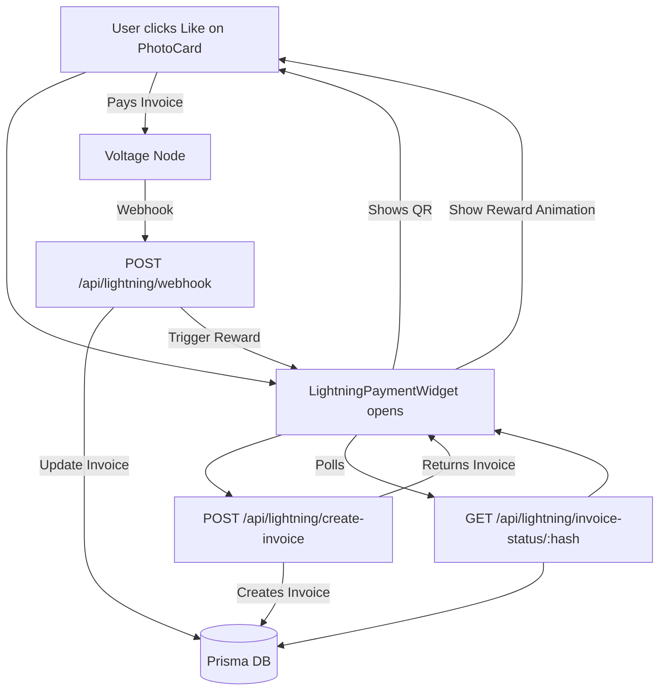
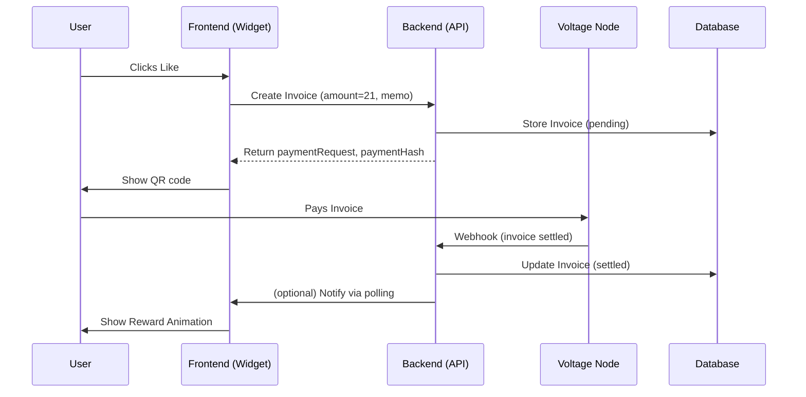
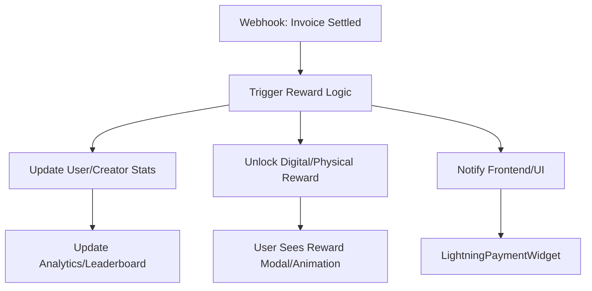

# Satsnap Lightning Like System — Implementation Progress (2024-04-26)

## ✅ Production-Ready Lightning Like System (MVP)

### Backend
- **Prisma schema**: Added `Invoice` model for Lightning payments (with status, expiry, settlement, etc.)
- **API endpoints**:
  - `/api/lightning/create-invoice`: Creates a real Lightning invoice (Voltage, ln-service, Prisma persistence, Zod validation, Redis rate limiting, Sentry/Winston logging)
  - `/api/lightning/webhook`: Handles settlement webhooks from Voltage, updates invoice status, triggers reward logic
  - `/api/lightning/invoice-status/[paymentHash]`: Returns invoice status for polling/payment confirmation
- **Reward logic**: Webhook triggers reward logic (stubbed, ready for user/creator integration)

### Frontend
- **LightningPaymentWidget**: Modular, dark-themed React component for invoice creation, QR code, and payment status polling (SWR)
- **Per-photo Lightning likes**: Each photo in the grid has a like button that opens the widget, sends 21 sats, and shows a reward animation on payment
- **PhotoCard**: Modular component for each photo, handles its own Lightning like/payment state
- **PhotoGrid**: Renders a grid of PhotoCards, tracks which photos have been rewarded

### Integration & UX
- **True per-photo Lightning like system**: 21 sats sent for every like, with real-time feedback and reward animation
- **Reward animation**: "Payment received! Reward unlocked!" on successful payment
- **All code modular and production-ready** (Next.js 14+, App Router, TypeScript, Tailwind, Framer Motion)

---

## ⚡️ System Architecture Diagram



---

## ⚡️ Payment Flow Sequence



## ⚡️ Reward Logic Flow



---

# Lightning Network Production Guide

# Satsnap

## Vision
**Satsnap is a photo-first, curated social app where every like instantly sends Bitcoin to creators over the Lightning Network.**

**No ads, no algorithms — just real support for real artists.**

**Fans who like photos earn rewards like limited-edition prints, creating true ownership and connection.**

**It's the magic of early Instagram, rebuilt for the Bitcoin era.**

### Why Satsnap?
Satsnap reimagines social media engagement through the lens of Bitcoin's Lightning Network, creating meaningful connections between photographers and their audience. In a world where "likes" have become meaningless metrics, Satsnap transforms each interaction into tangible value.

### Core Philosophy
- **Real Value Exchange**: Every like sends 21 sats directly to creators
- **Quality Over Quantity**: Curated creator onboarding ensures high-quality content
- **True Ownership**: Creators own their content, audience, and earnings
- **Meaningful Engagement**: Likes carry financial weight, eliminating empty engagement

### User Experience Goals
1. **For Creators**:
   - Direct value for their work through instant micropayments
   - Building genuine connections with supporters
   - Offering exclusive rewards to dedicated fans
   - Complete control over their earnings

2. **For Supporters**:
   - Supporting creators directly with each interaction
   - Building status through consistent support
   - Unlocking exclusive content and physical rewards
   - Participating in a genuine, ad-free community

### Technical Vision
The Lightning Network integration serves as the backbone for:
- Instant micropayments (21 sats per like)
- Automated reward distribution
- Creator earnings management
- Transparent value exchange

### Anti-Web2 Principles
- No algorithmic manipulation
- No data harvesting
- No middleman fees
- No artificial engagement metrics

This vision guides the technical implementation detailed below, ensuring that every feature serves the core purpose of creating meaningful connections through value exchange.

## Overview
This document outlines the requirements and steps for deploying the Lightning Network payment system to production, with a focus on the invoice creation endpoint and associated services.

## Architecture

### Lightning Network Integration
- **Provider**: Voltage Cloud
- **Implementation**: lnd gRPC/REST API integration
- **Payment Flow**: WebLN for client-side, Voltage node API for server-side
- **Settlement**: Instant Lightning Network payments
- **Hot Wallet**: Minimal balance strategy with automated top-ups

## Backend Implementation

### Managed Lightning Network with Voltage

Satsnap leverages [Voltage Cloud](https://www.voltage.cloud/) to provide a secure, scalable, and production-ready Lightning Network backend. Voltage manages our Lightning node infrastructure, allowing us to focus on product development while maintaining full control over our node and keys.

#### Key Components
- **Voltage Lightning Node**: Our node is hosted and managed by Voltage, providing high uptime, automatic backups, and enterprise-grade security (SOC 2 compliant).
- **API Integration**: The backend communicates with the Voltage node using the standard lnd gRPC/REST API. We use the [ln-service](https://github.com/alexbosworth/ln-service) Node.js library for robust Lightning operations.
- **Backend Stack**: Next.js API routes (or Express), PostgreSQL for persistent data, Redis for rate limiting and caching, and Sentry/Winston for monitoring and logging.
- **Security**: Node credentials (TLS cert, admin macaroon, connection string) are securely managed via environment variables. Only backend services have access to these secrets.
- **Monitoring**: We use Sentry for error tracking, Winston for structured logging, and Voltage's dashboard for node health and payment monitoring.

#### Workflow Overview
1. **Invoice Creation**: When a user likes a photo, the backend creates a Lightning invoice via the Voltage node API. The invoice is returned to the client for payment.
2. **Payment Settlement**: The backend subscribes to invoice updates using ln-service, updating the database and triggering reward logic when payments are received.
3. **Rate Limiting & Validation**: Redis is used to enforce per-IP rate limits. All inputs are validated using Zod schemas.
4. **Security & Compliance**: All API endpoints are protected with CORS, security headers, and origin checks. Node credentials are never exposed to the client.
5. **Monitoring & Logging**: All requests, errors, and payment events are logged and monitored for reliability and security.

#### Why Voltage?
- **No node maintenance**: Voltage handles uptime, upgrades, and backups.
- **Scalability**: Easily scale as user demand grows.
- **Security**: Enterprise-grade, with our own keys and access controls.
- **Developer Experience**: Standard lnd API, excellent documentation, and support.

For more details, see [Voltage Infrastructure Docs](https://docs.voltage.cloud/) and [ln-service](https://github.com/alexbosworth/ln-service).

## Alternative Backend Solutions: BTCPay & Strike

### BTCPay Server
[BTCPay Server](https://btcpayserver.org/) is an open-source, self-hosted Bitcoin and Lightning payment processor. It allows you to run your own Lightning node and provides a robust API for invoice creation, payment notifications, and wallet management.

**Key Features:**
- Fully self-hosted and open-source
- Supports both on-chain and Lightning payments
- Advanced invoice and payment API
- Integrates with lnd, c-lightning, and Eclair
- Built-in store and user management
- No third-party custody or fees

**Integration Model:**
- Deploy BTCPay Server (Docker, cloud, or VPS)
- Connect your backend to BTCPay's API for invoice creation and payment status
- Use webhooks or polling for payment settlement
- Full control over node, channels, and funds

**Best For:**
- Teams wanting maximum sovereignty and open-source ethos
- Projects with DevOps resources for node and server management

### Strike
[Strike](https://strike.me/) is a custodial Lightning payment platform focused on seamless fiat-to-Bitcoin payments and global remittances. Strike offers a simple API for sending and receiving Lightning payments, with automatic fiat conversion and compliance.

**Key Features:**
- Custodial wallet and Lightning node
- Instant fiat-to-Bitcoin conversion
- Simple REST API for payments and invoices
- No need to manage liquidity or channels
- KYC/compliance handled by Strike

**Integration Model:**
- Register for Strike API access
- Use Strike's REST API to create invoices and send payments
- Funds can be settled in BTC or fiat
- Minimal infrastructure required

**Best For:**
- Apps prioritizing fiat on/off-ramps and compliance
- Teams wanting to avoid node management entirely

### Comparison: Voltage Cloud vs. BTCPay vs. Strike

| Feature/Criteria         | Voltage Cloud                | BTCPay Server                | Strike                      |
|-------------------------|------------------------------|------------------------------|-----------------------------|
| Node Management         | Managed (non-custodial)      | Self-hosted (non-custodial)  | Custodial                   |
| API Type                | lnd gRPC/REST                | REST/WebSocket               | REST                        |
| Open Source             | No                           | Yes                          | No                          |
| Channel/Liquidity Mgmt  | Managed or manual            | Manual                       | N/A                         |
| Fiat Integration        | No                           | No                           | Yes                         |
| Compliance/KYC          | No                           | No                           | Yes                         |
| Uptime/SLA              | High (SLA)                   | Your responsibility          | High (SLA)                  |
| Customization           | High                         | Very High                    | Low                         |
| Best For                | Scaling, reliability         | Sovereignty, open-source     | Fiat flows, simplicity      |
| Fees                    | Subscription + routing fees  | Hosting + routing fees       | Platform fees                |

### Summary
- **Voltage Cloud**: Best for teams wanting a production-grade, non-custodial Lightning node with minimal maintenance and high reliability.
- **BTCPay Server**: Ideal for projects prioritizing sovereignty, open-source, and full control, with the tradeoff of more operational overhead.
- **Strike**: Perfect for apps needing fiat integration, compliance, and the simplest possible Lightning API, at the cost of custody and flexibility.

For most Bitcoin-native, creator-focused apps, Voltage or BTCPay are recommended. Strike is a strong option for global payments and fiat-centric use cases.

## Backend Research: Voltage, BTCPay Server, and Strike

### Voltage as a Hosted Lightning Node for Satsnap

**Voltage Overview:** Voltage Cloud is a Lightning-as-a-Service provider (launched 2020) that offers turnkey Bitcoin/Lightning infrastructure. In addition to Lightning nodes, it provides a Payments API for Bitcoin and stablecoins with instant settlement and extremely low fees. Voltage is SOC 2 Type II–compliant, emphasizing enterprise-grade security, and its open-source dashboard and encrypted backups ensure transparency. Developers can spin up Lightning nodes in minutes via the dashboard or REST API, avoiding the typical complexity of running a node from scratch.

**Node Capabilities:** Every Voltage Lightning node is a full LND node under the hood. Customers get full LND gRPC/REST API access as if the node ran on their own hardware. For example, one can create invoices via POST /v1/invoices or query node info via GET /v1/getinfo, using the node's unique DNS endpoint and admin macaroon for authentication. Voltage also exposes a Node Management API: you can programmatically create, start, stop, or delete nodes in your organization via Voltage's REST API. This makes it easy to automate node provisioning (for instance, spinning up a new Lightning node per creator or per region as needed).

**Key Features for Micropayments:** Voltage nodes are designed for always-on, high-throughput use. They boast "99.9% uptime" reliability, meaning your node is almost always reachable. You can back up your node's seed and macaroons (credentials) to Voltage's encrypted storage (AES-256), so keys are protected but recoverable if needed. Voltage supports Tor, allowing a node's API to be reachable via Tor for privacy. Crucially, it offers webhook notifications on Lightning events (e.g. invoice settled) so your app never misses a payment. (Alternatively, you can poll the LND API or use its streaming RPCs, but webhooks simplify real-time updates.) The system is "no vendor lock-in": you can always export your seed and switch providers, since the node runs standard LND.

**Security & Custody:** Voltage's model is non-custodial. When you create a node you set the seed and wallet password; Voltage never has access to your seed phrase or private keys. All sensitive files are encrypted client-side, and frequent backups are available for download. In short, users retain full control of funds ("Not your keys, not your coins"), unlike custodial wallets. This aligns well with Satsnap's "real Bitcoin payments" goal. The platform itself is audited (SOC 2) and uses best practices for data protection.

**Scalability:** Voltage runs on major cloud infrastructure (including Google Cloud) to enable global scale. Through partnerships with Google Cloud, Voltage can deploy nodes in multiple regions (e.g. Iowa, Netherlands, Singapore), reducing latency for a worldwide user base. Its architecture is containerized (Kubernetes) for elastic scaling, so it can handle spikes of micropayment traffic. Voltage is explicitly pitched for micropayments and high-volume use cases. In fact, Voltage itself touts Lightning's "near-zero fees" and ability to enable "micropayment experiences" that were impractical before.

**Developer Friendliness:** Voltage provides extensive documentation and examples. Its blog and docs explain how to connect (download TLS cert and macaroon) and call any LND API as if local. The Voltage Payments API further abstracts Lightning calls; you can create Lightning "wallets" and issue invoices with a single HTTPS call. For example, the Payments API lets you POST /organizations/{org_id}/wallets to create a wallet and POST /organizations/{org_id}/payments to create or send payments. Voltage's open-source dashboard and utilities (e.g. auto-unlock, zero-conf plugins) and standard LND interface means you can use any popular Lightning library or tool you like. In sum, Voltage combines turnkey hosting with developer APIs so teams can integrate Lightning quickly without deep node management expertise.

### Comparison: Voltage vs. BTCPay Server vs. Strike

| Aspect         | Voltage Cloud | BTCPay Server | Strike |
|---------------|--------------|---------------|--------|
| Custody       | Non‑custodial: user controls seed and keys. | Non‑custodial: self‑hosted node, funds to your own wallet. | Custodial: Strike holds private keys on your behalf. |
| Setup Effort  | Easy sign-up; no hardware. Launch nodes in minutes via UI or API. | Requires self-hosting (cloud or on-prem) and maintenance. | Minimal: just create an account and link bank (lightning enabled by default). |
| Fees          | No Lightning protocol fees (near-zero). Node hosting billed usage ($0.053/hr standard). | 0% service fees; only on-chain or channel fees. | Lightning sends incur routing fees (~tiny, possibly markup by Strike); USD rails may have small fees (e.g. ACH or wire). |
| Flexibility   | High: managed LND node with gRPC/REST, webhook support, Tor. Cloud-scale, many regions. | Very high: open-source, supports LND/CLN/Eclair, Bitcoin and Lightning, can customize fully. | Limited to Strike's platform features; primarily Lightning wallet service. |
| Fiat Settlement | Supports USD on‑ramp/off‑ramp via Payments platform. (Stablecoins also supported.) | None built-in: only crypto. Must use third-party exchanges or plugins for fiat. | First-class USD support: link bank for ACH/wires (fiat wallet plus Lightning). |
| Dev UX        | REST/gRPC APIs + extensive docs. Open-source dashboard. Webhooks for events. | Rich API (BitPay-compatible) for invoices/stores, plus Lightning UI (RTL) and webhooks. Self-hosted complexity. | Primarily app/Web UI. Limited public APIs. Supports Lightning Addresses and webhooks for payments, but less dev documentation. |

**Pros & Cons for Satsnap's MVP:**
- **Voltage (Hosted LND node):**
  - **Pros:** Non‑custodial (fits "real Bitcoin" and creator control), fully featured LND access (gRPC/REST/webhooks), enterprise reliability and global scale. Quick to start and scalable for micropayment volumes. Supports USD/stablecoin rails if needed.
  - **Cons:** It is a centralized service (though keys remain yours), so not 100% "decentralized" ethos. There is a cost (node uptime billing). Creators would not personally run their own node unless Satsnap builds that feature; typically Satsnap would manage one or several nodes. However, Voltage's "no lock-in" and exported seed capability mean it is more open than purely custodial services.
- **BTCPay Server (Self-hosted):**
  - **Pros:** Fully open-source and censorship-resistant, with 0% fees and full control. Aligns with anti‑Web2 ideals. Creators could technically run their own instance or use decentralized hosting. Lightning is natively supported, so 21-sat payments are technically possible (as long as channel capacity exists). Strong flexibility for custom UI/integration and fiat can be added via plugins.
  - **Cons:** Higher setup and maintenance burden (need to host a server and manage liquidity). Out of the box there is no fiat on/off (would need external integrations). Developer UX is good but more manual (you'd talk to your own LND or BTCPay's API). For an MVP, this adds complexity: handling channels, liquidity, backups, and scaling is all on your team.
- **Strike (Custodial Lightning Wallet):**
  - **Pros:** Extremely easy to integrate (users need only a Strike account) and supports USD natively. Payments are simple Lightning transfers within Strike's network. Good user-friendly experience for non-technical users.
  - **Cons:** Not aligned with "real Bitcoin" or "creator control" – Strike is custodial (a third party holds keys) and could freeze funds. It also violates Satsnap's anti-Web2 ethos. Developers have limited APIs (Lightning Address and webhooks, but not a full-fledged node API). Strike's payment volume and liquidity for many micropayments is unclear. Overall, Strike is the least decentralized and therefore least aligned with Satsnap's goals, though it is very convenient.

In summary, Voltage and BTCPay both support true Bitcoin Lightning payments with user-controlled custody, while Strike trades decentralization for ease of use and built-in fiat. For Satsnap's 21-sat-per-like model (many tiny, on-chain-avoiding payments with creator-owned funds), a Lightning solution like Voltage or BTCPay is preferable. Voltage offers a managed path to scale quickly, whereas BTCPay offers ultimate openness at the cost of more engineering effort.

## Integrating Voltage into Satsnap (21-sat Micropayments)

To implement "21 sats per like" with Voltage, Satsnap would effectively use a Voltage Lightning node to issue and settle invoices for each like. Here is a high-level integration approach:

1. **Set Up a Voltage Node:** First, create a Lightning node in your Voltage dashboard or via their Node API. Choose mainnet, enable LND, and configure settings (e.g. RPC endpoints, whitelist). Once created, download the node's TLS certificate and admin macaroon from the Voltage UI. The node's unique base URL (e.g. your-node-name.m.voltageapp.io:8080) and macaroon serve as your RPC endpoint and credentials.
2. **Create Lightning Invoices:** When a user likes a post, Satsnap should generate a Lightning invoice for 21 sat. Using the LND REST API on your Voltage node, make a POST https://{REST_HOST}/v1/invoices call with JSON `{ "value": 21, "memo": "Like payment" }`. The response will include a payment_request (a BOLT11 invoice string). Alternatively, Voltage's Payments API can create the same invoice via POST /organizations/{org_id}/payments (type=receive, amount=21) in one step.
3. **Present Invoice to Payer:** Send the invoice string (or its QR code/LNURL) to the paying user's Lightning wallet. The user (or your app on their behalf) pays it. Satsnap might keep a session or reference so it knows which invoice corresponds to which like event.
4. **Detect Payment:** Once the invoice is paid, the Lightning node will mark it settled. You have two options to detect this in real time:
   - **Webhooks:** Voltage supports webhook callbacks for invoice events. Configure a webhook URL in the dashboard that points to your backend; Voltage will POST to it when the invoice is paid.
   - **Polling/Streaming RPC:** Alternatively, your backend can poll GET /v1/invoices/{r_hash} or use gRPC's subscribeInvoices on the node to watch for settlement. Using webhooks is simpler for an MVP.
5. **Complete the Like:** When you receive confirmation (via webhook or poll) that the invoice is paid, credit the creator with 21 sats in your app's database and mark the post as liked. Optionally, you can immediately forward the funds out of the Satsnap node to the creator's own Lightning node or wallet. To pay out, use LND's POST /v1/channels/transactions (or the Payments API send endpoint). For example, a JavaScript snippet to pay an invoice is:

```js
// Pay an invoice on the Voltage node
const response = await fetch(`https://${REST_HOST}/v1/channels/transactions`, {
  method: 'POST',
  headers: { 'Grpc-Metadata-macaroon': MACAROON, 'Content-Type': 'application/json' },
  body: JSON.stringify({ payment_request: 'lnbc1...', amt: 21 })
});
```

If you simply want to credit creators off-chain, you can skip this step and let them withdraw later.

6. **Set Invoice Expiry:** By default, LND invoices have a 1-hour expiry. Since "likes" might happen quickly, 1 hour is fine; but if you expect delays, you can set a longer expiry (expiry field) when creating the invoice. If an invoice expires unpaid, treat it as a failed like (you may regenerate a new invoice if needed).
7. **Best Practices & Caveats:**
   - **Liquidity:** Ensure your Voltage node has enough inbound capacity to receive many 21-sat payments. You may need to open channels or use services like Lightning Pool for inbound liquidity.
   - **Routing Fees:** Lightning payments incur tiny routing fees. For a 21-sat payment, these are typically a few satoshis or less (often ~0.1% of amount), so they are negligible for micropayments.
   - **Dust Limits:** 21 sats is above Lightning's dust threshold (so it should route fine). Always verify payments against exact invoice amounts to avoid partial payments.
   - **Concurrency:** Multiple likes in quick succession mean multiple invoices; ensure your code creates unique invoices (each LND invoice has a unique hash). Using the Payments API, each POST /payments returns a distinct invoice ID.
   - **Error Handling:** Handle failures gracefully (network glitches, unpaid invoices). You might retry invoice creation or allow a short time for payment.
   - **Monitoring:** Use Voltage's dashboard or Prometheus endpoints to monitor node health, channel balances, and invoice success rate.

By following the above flow with Voltage's APIs, Satsnap can implement sub-second 21-sat Lightning payments. The Voltage developer docs and code examples will guide the exact API calls. In summary: create an invoice via LND/Voltage API, await payment via webhook, then confirm the like in your app. This yields instant, real Bitcoin micropayments under creator control, in line with Satsnap's goals.

**Sources:** Voltage documentation and blog; Google Cloud case study; BTCPay Server site; Strike FAQ. These cover node features, APIs, and the relevant comparisons above.

#### Invoice Creation Endpoint
```typescript
POST /api/lightning/create-invoice
Content-Type: application/json

Request:
{
  "amount": number,    // Amount in satoshis
  "memo": string      // Optional payment memo
}

Response:
{
  "paymentRequest": string,  // Lightning invoice
  "paymentHash": string,    // Payment identifier
  "expiresAt": string      // ISO timestamp
}
```

#### Required Environment Variables
```env
VOLTAGE_LND_CERT=your_voltage_cert
VOLTAGE_LND_MACAROON=your_voltage_macaroon
VOLTAGE_LND_SOCKET=your_voltage_node_socket
REDIS_URL=your_redis_url
SENTRY_DSN=your_sentry_dsn
```

### 2. Security Measures

#### Rate Limiting
- 50 requests per minute per IP
- Redis-based implementation
- Burst allowance configuration
- Rate limit headers in responses

#### Input Validation
- Zod schema validation
- Amount bounds checking
- Memo length restrictions
- Request size limits

#### Authentication & Authorization
- API key validation
- CORS policy implementation
- Security headers configuration
- Request origin verification

### 3. Error Handling

#### Error Types
- `INVALID_INPUT`: 400 Bad Request
- `RATE_LIMITED`: 429 Too Many Requests
- `PAYMENT_FAILED`: 402 Payment Required
- `SERVER_ERROR`: 500 Internal Server Error

#### Error Response Format
```typescript
{
  error: string,
  code: string,
  details?: unknown,
  requestId?: string
}
```

### 4. Monitoring & Logging

#### Metrics to Track
- Invoice creation success rate
- Payment settlement time
- Error rates by type
- API latency
- Rate limit hits

#### Logging Requirements
- Request/response logging
- Error logging with context
- Performance metrics
- Security events

### 5. Database Schema

#### Invoice Table
```sql
CREATE TABLE invoices (
  id UUID PRIMARY KEY,
  payment_hash VARCHAR(64) UNIQUE,
  amount_sats BIGINT,
  memo TEXT,
  status VARCHAR(20),
  expires_at TIMESTAMP,
  settled_at TIMESTAMP,
  created_at TIMESTAMP,
  updated_at TIMESTAMP
);
```

#### Indexes
- `payment_hash` (UNIQUE)
- `status, created_at`
- `expires_at` (for cleanup)

### 6. Testing Requirements

#### Unit Tests
- Input validation
- Rate limiting logic
- Error handling
- Database operations

#### Integration Tests
- API endpoint functionality
- Voltage node integration
- WebLN compatibility
- Payment flow

#### Load Tests
- Concurrent request handling
- Rate limit effectiveness
- Error rate under load
- Response time degradation

### 7. Deployment Checklist

#### Pre-deployment
- [ ] Environment variables configured
- [ ] Database migrations ready
- [ ] Rate limiting tested
- [ ] Security headers configured
- [ ] CORS policies set
- [ ] Error tracking configured
- [ ] Logging pipeline tested
- [ ] Monitoring alerts configured
- [ ] Load testing completed
- [ ] Documentation updated

#### Post-deployment
- [ ] Verify API accessibility
- [ ] Test payment flow
- [ ] Check monitoring dashboards
- [ ] Verify logging pipeline
- [ ] Test error reporting
- [ ] Validate rate limiting
- [ ] Check security headers
- [ ] Monitor error rates

### 8. Maintenance Procedures

#### Regular Tasks
- Clean up expired invoices
- Monitor error rates
- Review security logs
- Update API keys
- Verify backup procedures

#### Incident Response
- Error rate threshold alerts
- Payment failure investigation
- Rate limit adjustment
- Security incident response
- System recovery procedures

## Dependencies

```json
{
  "dependencies": {
    "ln-service": "^7.0.0",
    "ioredis": "^5.0.0",
    "zod": "^3.0.0",
    "@sentry/nextjs": "^7.0.0",
    "winston": "^3.0.0"
  }
}
```

## Additional Resources

### Documentation
- [Voltage Infrastructure Docs](https://docs.voltage.cloud/)
- [WebLN Specification](https://webln.dev)
- [Lightning Network Best Practices](https://lightning.network)

### Support Channels
- Voltage Cloud Support
- Lightning Network Community
- MSTY Technical Support

## Rollout Strategy

### Phase 1: Development
- Implement core functionality
- Set up monitoring
- Initial testing

### Phase 2: Staging
- Deploy to staging environment
- Integration testing
- Load testing
- Security audit

### Phase 3: Production
- Gradual rollout
- Monitor metrics
- Gather feedback
- Optimize performance

### Phase 4: Optimization
- Analyze performance
- Adjust rate limits
- Fine-tune monitoring
- Update documentation

## MVP Features & Roadmap

### Core Features (Day 1 Launch)

#### 1. User Wallet Integration
- **Implementation**: Custodial Lightning wallet for optimal UX
- **Features**:
  - QR code deposit flow
  - Lightning Address support
  - On-chain BTC loading
  - Instant creator payouts
- **Technical Requirements**:
  - Secure wallet creation/management
  - Real-time balance updates
  - Transaction history tracking
  - Multi-currency conversion display

#### 2. Photo Upload System
- **Creator Features**:
  - Single photo upload workflow
  - Title and description fields
  - Configurable reward milestones
- **Technical Requirements**:
  - Image optimization pipeline
  - Metadata management
  - Content delivery network integration
  - EXIF data handling

#### 3. Lightning-Powered Likes
- **Core Mechanics**:
  - 21 sats per like
  - Instant payment processing
  - Real-time balance updates
- **UI/UX Requirements**:
  - Fluid animation system
  - Sats flow visualization
  - Heart feedback animation
  - Error state handling

#### 4. Reward System
- **Features**:
  - Milestone progress tracking
  - Automated reward unlocking
  - Digital reward distribution
  - Physical reward fulfillment
- **Technical Implementation**:
  - Progress tracking database
  - Secure address collection
  - Automated distribution system
  - Reward claim verification

#### 5. Curated Feed
- **Core Principles**:
  - Quality-focused curation
  - Manual creator verification
  - Clean, focused interface
- **Technical Requirements**:
  - Creator application system
  - Content moderation tools
  - Feed optimization algorithm
  - Performance monitoring

#### 6. User Profiles
- **Display Metrics**:
  - Total sats sent
  - Supported artists count
  - Collector tier system
- **Technical Requirements**:
  - Real-time stats calculation
  - Badge progression system
  - Profile data caching
  - Achievement tracking

#### 7. Activity Feed
- **Features**:
  - Like history tracking
  - Sats transaction log
  - Reward milestone alerts
- **Technical Requirements**:
  - Real-time notification system
  - Activity data aggregation
  - User engagement metrics
  - Performance optimization

### Future Iterations (Post-MVP)

#### Planned Features
1. **Golden Like Jackpot**
   - Random reward multiplication
   - Engagement gamification
   - Special animation system

2. **Auto Top-Up System**
   - Configurable thresholds
   - Automated wallet funding
   - Payment method management

3. **Exclusive Drops**
   - Limited-time offerings
   - Creator collaborations
   - Scarcity mechanics

4. **IRL Event Integration**
   - Event ticket unlocks
   - Gallery show access
   - Meet-and-greet coordination

5. **Decentralized Storage**
   - Arweave integration
   - Filecoin backup system
   - Content permanence

### Core Narrative

> "Every like matters. Every sats counts. Build real art collections with real value, one heart at a time."

This narrative drives our technical decisions and feature prioritization, ensuring that every component contributes to a meaningful, value-driven social experience.

### Success Metrics

1. **Engagement Metrics**
   - Average sats per user
   - Like-to-view ratio
   - Reward completion rate

2. **Creator Metrics**
   - Earnings per post
   - Reward fulfillment rate
   - Creator retention

3. **Platform Health**
   - Transaction success rate
   - Feed quality score
   - User growth velocity

## Wireframe & UI Specifications

### Design Philosophy

#### Visual Language
- **Color Palette**:
  - Primary: Bitcoin Orange (#F7931A)
  - Monochrome base scheme
  - Minimal accent colors
- **Typography**:
  - Heading: Elegant Serif (e.g., Freight Display Pro)
  - Body: Modern Sans-Serif (e.g., Inter)
- **Spacing System**:
  - 8px base grid
  - Consistent vertical rhythm
  - Generous whitespace

### Screen Specifications

#### 1. Home Feed
```
┌─────────────────────────────┐
│ ⚡ 21,000    [Gold Badge]   │ <- Status Bar
├─────────────────────────────┤
│                             │
│                             │
│      [Full-Bleed Photo]     │ <- Main Content
│                             │
│                             │
├─────────────────────────────┤
│ @artist_name                │
│ Short bio text              │
│                             │
│         [❤️ 21 sats]        │ <- Action Bar
│                             │
│ [───── Reward Progress ────] │
└─────────────────────────────┘
```

**Technical Requirements**:
- Vertical swipe gesture handling
- Preloading of next/previous images
- Lightning payment trigger on like
- Real-time progress bar updates
- Fluid animation system for zaps

#### 2. Photo Detail View
```
┌─────────────────────────────┐
│ ← Back                      │
├─────────────────────────────┤
│      [Full-Size Photo]      │
│                             │
├─────────────────────────────┤
│ Caption/Story               │
│ ❤️ 1,234 likes              │
│ ⚡ 25,914 sats earned        │
│                             │
│ [View Artist Portfolio]     │
└─────────────────────────────┘
```

**Technical Requirements**:
- High-res image loading
- Metadata management
- View tracking
- Portfolio link routing

#### 3. Reward Unlock Modal
```
┌─────────────────────────────┐
│         🎉                  │
│  Reward Unlocked!           │
│                             │
│  [Preview Image]            │
│                             │
│  [Claim Digital Download]   │
│  [Request Physical Print]   │
│                             │
│  [Maybe Later]              │
└─────────────────────────────┘
```

**Technical Requirements**:
- Secure download system
- Address collection form
- Fulfillment tracking
- Modal state management

#### 4. Profile Pages

##### Creator Profile
```
┌─────────────────────────────┐
│      [Banner Image]         │
│                             │
│ @username                   │
│ Artist Statement            │
│ ⚡ Total Earnings            │
│                             │
│ Current Rewards:            │
│ [Reward 1] [Reward 2]      │
│                             │
│ Gallery:                    │
│ [Photo Grid]               │
└─────────────────────────────┘
```

##### Liker Profile
```
┌─────────────────────────────┐
│ [Profile Picture]           │
│ @username                   │
│                             │
│ Gold Collector              │
│ ⚡ 25,000 sats sent         │
│                             │
│ Artists Supported:          │
│ [Artist List]              │
│                             │
│ Reward History:            │
│ [Unlocked Items]           │
└─────────────────────────────┘
```

#### 5. Wallet Interface
```
┌─────────────────────────────┐
│ Balance: ⚡ 21,000          │
│                             │
│ [Add Sats]                  │
│  • QR Code                  │
│  • Lightning Address        │
│                             │
│ [Withdraw]                  │
│  • External Wallet          │
│                             │
│ [Transaction History]       │
└─────────────────────────────┘
```

**Technical Requirements**:
- Real-time balance updates
- QR code generation
- Lightning Address validation
- Transaction logging

#### 6. Onboarding Flow
```
Step 1: Profile Creation
┌─────────────────────────────┐
│ Create Your Profile         │
│ [Username Input]            │
│ [Profile Picture Upload]    │
└─────────────────────────────┘

Step 2: Wallet Setup
┌─────────────────────────────┐
│ Setup Your Wallet           │
│ [Create New Wallet]         │
│ [Link External Wallet]      │
└─────────────────────────────┘

Step 3: Initial Funding
┌─────────────────────────────┐
│ Get Started                 │
│ [Add Initial Sats]          │
│ [Skip for Now]              │
└─────────────────────────────┘
```

### Navigation Structure
```
App Root
├── Home Feed
│   └── Photo Detail
├── Wallet
│   ├── Add Sats
│   └── Withdraw
├── Profile
│   ├── Creator View
│   └── Liker View
└── Reward System
    └── Unlock Modal
```

### UI Components Library

#### Core Components
1. **PhotoCard**
   - Full-bleed image container
   - Like button
   - Progress bar
   - Artist info

2. **LightningButton**
   - Payment trigger
   - Animation state
   - Loading state
   - Success feedback

3. **RewardProgress**
   - Progress visualization
   - Milestone markers
   - Unlock animation

4. **WalletBalance**
   - Real-time updates
   - Currency conversion
   - Animation effects

#### Animation Specifications

1. **Like Animation**
   ```
   Initial State → Tap →
   Heart Scale Up (150ms) →
   Lightning Bolt (200ms) →
   Sats Counter Update (300ms)
   ```

2. **Reward Unlock**
   ```
   Threshold Reached →
   Celebration Particles →
   Modal Slide Up →
   Content Fade In
   ```

### Performance Requirements

1. **Image Loading**
   - Progressive loading
   - Lazy loading
   - Preloading next item
   - Cache management

2. **Animation Performance**
   - 60fps target
   - Hardware acceleration
   - Memory management
   - Battery optimization

3. **Payment Processing**
   - < 100ms response time
   - Offline queue support
   - Retry mechanism
   - Error recovery 

## 🚧 Still To Do

### Physical Reward Fulfillment
- **Milestone-based unlocks:** When a user reaches a sats or like milestone, trigger eligibility for a physical reward (e.g., print, merch).
- **Address collection:** Securely collect and store shipping info from the user (with privacy and GDPR compliance).
- **Fulfillment pipeline:** Integrate with print-on-demand or shipping provider APIs, or build an admin dashboard for manual fulfillment.
- **Status tracking:** Track reward claim, shipping, and delivery status in the database.
- **User notifications:** Notify users of reward unlock, claim steps, and shipping updates (email, in-app, etc.).
- **Admin tools:** Dashboard for managing claims, fulfillment, and support.

--- 